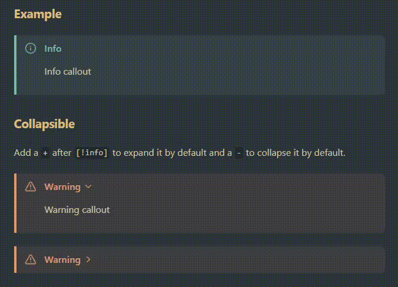

# Animated Obsidian callouts

[animated-callouts.css](animated-callouts.css) is a [CSS snippet for Obsidian](https://help.obsidian.md/Extending+Obsidian/CSS+snippets) that modifies the appearance of [callouts](https://help.obsidian.md/Editing+and+formatting/Callouts).

## How to use

To use the CSS snippet, follow these steps:

1. In Obsidian, open **Settings**.
2. Under **Appearance → CSS snippets**, select **Open snippets folder** (folder icon).
3. In the snippets folder, copy in [animated-callouts.css](animated-callouts.css).
4. In Obsidian, under **Appearance → CSS snippets**, select **Reload snippets** (refresh icon) to see the snippet in the list.
5. Enable the toggle to the right of **animated-callouts**.

## Miscellaneous

- [Obsidian Sync](https://obsidian.md/sync) does not currently sync CSS snippets.
